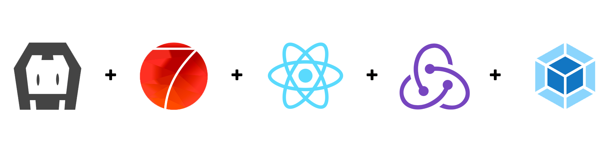

[](https://travis-ci.org/lambirou/cordova-framework7-react)
[](https://david-dm.org/lambirou/cordova-framework7-react)
[](https://david-dm.org/lambirou/cordova-framework7-react?type=dev)
[![Gitter][chat-img]][chat]

[chat-img]: https://img.shields.io/badge/Chat-on_gitter-teal.svg
[chat]: https://gitter.im/lambirou-cordova-framework7-react/community?utm_source=share-link&utm_medium=link&utm_campaign=share-link

<br>



# Modern Hybrid App Boilerplate

### Preface

This is a full fledged **PRODUCTION READY** workflow boilerplate for building rapid and beautiful application.

The technologies used in this workflow boilerplate shows case a `subset of technologies` we are currently using within our team ( **we put this project in github mainly as recruiting purpose for our team** ), and we are trying to give our candidates confidence that by working with us, they will be using decent technologies as well as staying relevant to the industry. And that is what our team strongly believed in - **technology innovation and promoting developers' relevancy in the industry**.

If you are interested in working with us, feel free to send a message to [lambirou](https://www.twitter.com/lambirou).

### Features

Features

- Framework7 v4
- React v16
- Redux
- Webpack v4
- Cordova
- Ionic Native v5
- ES6 / ES7
- SASS / SCSS

## Installation

Step 1: Clone this repo

```
git clone https://github.com/lambirou/cordova-framework7-react.git my-app
cd my-app
```

Step 2: Install

```
npm install
```

Step 3: Start

```
npm start
```

And Done, as easy as 123!!

### List of NPM Commands

```sh
$ npm run dev       # build and watch, but javascript and css not minified
$ npm run build     # build a minified production version
```

### List of Cordova Commands

```sh
$ cordova platform add ios      # add android ios to your project
$ cordova platform add android    # add android platform to your project

$ cordova run ios # launch the app on iOS device or emulator
$ cordova run android # launch the app on Android device or emulator
```

After that, all Cordova commands can be used.

## How to Contribute

We welcome anyone to send us **pull request** to improve this boilerplate, the goal is to make it better from time to time and we all can learn from it.

This boilerplate will be maintained separately. So please do not check in any business logic to it unless it is for example purpose.

## Maintainers

<!-- ALL-CONTRIBUTORS-LIST:START - Do not remove or modify this section -->

| [<br /><sub><b>Roland Edi</b></sub>](https://github.com/lambirou)<br /> |
| :-----------------------------------------------------------------------------------------------------------------------------------------------------------: |


<!-- ALL-CONTRIBUTORS-LIST:END -->

## License

MIT ©
